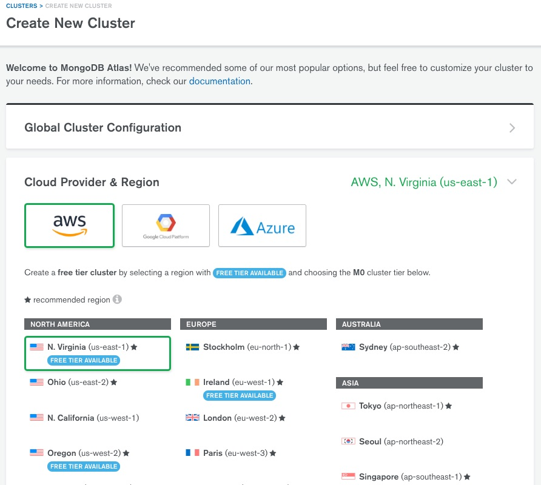

# mdb-101-healthcare-workshop
This repository contains a guide on getting started with MongoDB.
Specifically, this is a step-by-step tutorial/workshop incorporating MongoDB Compass, MongoDB Atlas, and MongoDB Stitch.
The data utilized in this workshop is based on the health care domain.  The data was acquired by generating sample data 
in FHIR format (https://www.hl7.org/fhir/formats.html) from https://github.com/synthetichealth/synthea.

# Introduction to MongoDB
## Hands-on Workshop

### Overview
This hands-on workshop is designed to get you familiar with all general aspects of MongoDB.  This includes using either
a local running version of MongoDB or MongoDB Atlas (database as a service).  This workshop will walk you through
importing data into your MongoDB instance/MongoDB Atlas cluster.  Using MongoDB Compass, this workshop will provide
guidance on how to query data (CRUD), introduce the user to the aggregation framework, and optimize queries (explain plans/
indexes).  Next, the user can see how queries can be written in Node and Python.  Finally, the user will be introduced 
to MongoDB Atlas as well as the serverless platform, MongoDB Stitch.

### Prerequisites
To successfully complete this workshop, the following software should be installed:
* [MongoDB Compass](https://www.mongodb.com/download-center/compass) - This is a GUI to MongoDB that will be used to 
write queries.

* Access to a MongoDB instance.  You can either download [MongoDB](https://www.mongodb.com/download-center/enterprise)
and set it up on a workstation/server.  Or, the *recommended* way to complete the workshop, is by using [MongoDB
Atlas](https://www.mongodb.com/cloud/atlas), the fully managed service from MongoDB.  To access, simply create an account
at [https://cloud.mongodb.com](https://cloud.mongodb.com) or login to an existing account you may have previously
created. More details are below.

* To run the Node sample, be sure to have Node properly installed

* To run the Python sample, be sure to have Python properly installed

* The ability to interface with a REST endpoint (curl, [Postman](https://www.getpostman.com/), browser)

### Note:
If you use MongoDB Atlas, you must be able to make outgoing requests from your computer to MongoDB Atlas services
which will be running on port 27017.  Please confirm that port 27017 is not blocked by checking with 
[PortQuiz](http://portquiz.net:27017).  If successful, you will see a page load that indicates you can make outgoing
requests on port 27017.  The page looks similar to the one below:

### Hands-on Labs
#### Lab 1 - Create the Cluster (Skip to Lab 2 if you have MongoDB installed locally)
#### Create a Free Tier Cluster
#### Click Build a Cluster

Be sure to select the Free Tier Option for your cluster.
Take a moment to browse the options (Provider & Region, Cluster Tier, Version, Backup, ...).  For this workshop,
select AWS as the Cloud Provider:

Keep all of the defaults.  Be sure to name your Cluster Name to FHIR-Workshop (or anything you prefer) and then
click the green button to Create Cluster:

The cluster should complete provisioning within 5-7 minutes.

#### Install MongoDB Compass if you have not already
MongoDB Compass is the GUI for MongoDB.  Go to https://www.mongodb.com/download-center/compass to download and
install Compass for your platform.

#### After your MongoDB Atlas Cluster has been provisioned, setup Connection Security:
Return to the Atlas UI.  Your cluster should be provisioned.  Click the CONNECT button which will prompt you to setup
security:

After clicking the connect button, you should see the following:

Add your current IP address and Create a MongoDB User.  This example assumes a Username of 'fhir' and password 'workshop'.

Click Choose a connection method and select Connect with MongoDB Compass.

Then select 'I am using Compass 1.12 or later' and COPY the connection string presented:

#### Connect Compass
Start Compass and it should detect the connection string in your copy buffer:

Select Yes.

Provide the password ('workshop') and before clicking CONNECT, CREATE A FAVORITE named FHIR-Workshop.  This will
allow us to quickly connect to the cluster in the future.

Click CONNECT.

If successful, you will see some internal databases used by MongoDB:

#### Lab 2 - Load Data
We are going to load data that has been parsed from files in the FHIR format.

1. CRUD ops
    1. insert document
    2. find - specify inner array
    3. specify conditions, AND/OR conditions
    4. Query inner documents
    5. match array
    6. query docs for compound filter conditions
    7. elematch 
    8. query based on array position
    9. query based on array length
    10. project fields to return/suppress _id
    11. check for null field
    12. { item : { $type: 10 } }
    13. existence check
    14. update
    15. delete docs
    16. text search / exact phrase/term exclusion
    17. geospatial with compass
    18. aggregation framework (with code)
2. Change Streams?
3. Write queries in application code
4. Move into MDB Atlas
    1. Create cluster/import data/query from UI
    2. Create Stitch application
    3. Webhook/trigger/high-level html/javascript web page to host
    4. Visualize data/charts

