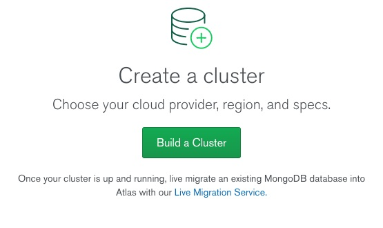
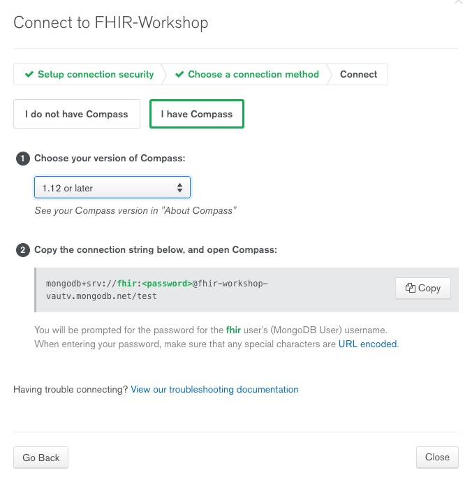
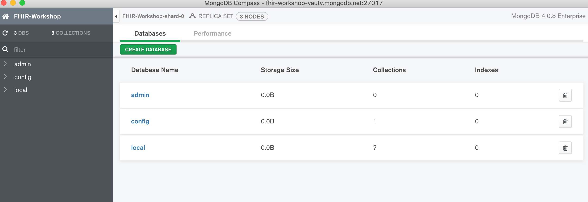

# mdb-101-healthcare-workshop
This repository contains a guide on getting started with MongoDB.
Specifically, this is a step-by-step tutorial/workshop incorporating MongoDB Compass, MongoDB Atlas, and MongoDB Stitch.
The data utilized in this workshop is based on the health care domain.  The data was acquired by generating sample data 
in [FHIR](https://www.hl7.org/fhir/formats.html) format from the [Synthea](https://github.com/synthetichealth/synthea)
project.

# Introduction to MongoDB
## Hands-on Workshop

### Overview
This hands-on workshop is designed to get you familiar with all general aspects of MongoDB.  This includes using either
a local running version of MongoDB or MongoDB Atlas (database as a service).  This workshop will walk you through
importing data into your MongoDB instance/MongoDB Atlas cluster.  Using MongoDB Compass, this workshop will provide
guidance on how to query data (CRUD), introduce the user to the aggregation framework, and optimize queries (explain plans/
indexes).  Next, the user can see how queries can be written in Node and Python.  Finally, the user will be introduced 
to MongoDB Atlas as well as the serverless platform, MongoDB Stitch.

### Required Prerequisites
To successfully complete this workshop, the following software should be installed:

* [MongoDB Compass](https://www.mongodb.com/download-center/compass) - This is a GUI to MongoDB that will be used to 
write queries.

* Access to a MongoDB instance.  You can either download [MongoDB](https://www.mongodb.com/download-center/enterprise)
and set it up on a workstation/server.  Or, the *recommended* way to complete the workshop, is by using [MongoDB
Atlas](https://www.mongodb.com/cloud/atlas), the fully managed service from MongoDB.  To access, simply create an account
at [https://cloud.mongodb.com](https://cloud.mongodb.com) or login to an existing account you may have previously
created. More details are below.

### Optional Prerequisites
During the course of the workshop, code samples will be used with both Node.js and Python.  If you choose to edit/run
the provided source files, you will need to be sure to have the following installed:

* Node.js - If you would like to edit/run the Node.js source files

* Python - If you would like to edit/run the Python source files

* For the MongoDB Stitch section, the workshop will interface with a REST endpoint.  This will be a GET method and
can be easily done with your browser.  However, if you want to use something like cURL or 
[Postman](https://www.getpostman.com/), please be sure to have the tools installed.

### Advanced/Optional Prerequisites
In Lab 2, the workshop will guide the user to load data using MongoDB Compass.  If you are an advanced MongoDB
user and would prefer to use the terminal/command-line, be sure to have the MongoDB command-line tools
installed.  The workshop does *not* go into detail on the installation/use of these tools.

* Binary Import and Export Tools  
[mongorestore](https://docs.mongodb.com/manual/reference/program/mongorestore)  
[mongodump](https://docs.mongodb.com/manual/reference/program/mongodump)  

* Data Import and Export Tools
[mongoimport](https://docs.mongodb.com/manual/reference/program/mongoimport)  
[mongoexport](https://docs.mongodb.com/manual/reference/program/mongoexport)  

### Note:
If you use MongoDB Atlas, you must be able to make outgoing requests from your computer to MongoDB Atlas services
which will be running on port 27017.  Please confirm that port 27017 is not blocked by checking with 
[PortQuiz](http://portquiz.net:27017).  If successful, you will see a page load that indicates you can make outgoing
requests on port 27017.  The page looks similar to the one below:

### Hands-on Labs
#### Lab 1 - Create the Cluster (Skip to Lab 2 if you have MongoDB installed locally)
#### Create a Free Tier Cluster
#### Click Build a Cluster

Be sure to select the Free Tier Option for your cluster.
Take a moment to browse the options (Provider & Region, Cluster Tier, Version, Backup, ...).  For this workshop,
select AWS as the Cloud Provider:

Keep all of the defaults.  Be sure to name your Cluster Name to FHIR-Workshop (or anything you prefer) and then
click the green button to Create Cluster:

The cluster should complete provisioning within 5-7 minutes.

#### Install MongoDB Compass if you have not already
MongoDB Compass is the GUI for MongoDB.  Go to https://www.mongodb.com/download-center/compass to download and
install Compass for your platform.

#### After your MongoDB Atlas Cluster has been provisioned, setup Connection Security:
Return to the Atlas UI.  Your cluster should be provisioned.  Click the CONNECT button which will prompt you to setup
security:

After clicking the connect button, you should see the following:

Add your current IP address and Create a MongoDB User.  This example assumes a Username of 'fhir' and password 'workshop'.

Click Choose a connection method and select Connect with MongoDB Compass.

Then select 'I am using Compass 1.12 or later' and COPY the connection string presented:

#### Connect Compass
Start Compass and it should detect the connection string in your copy buffer:

Select Yes.

Provide the password ('workshop') and before clicking CONNECT, CREATE A FAVORITE named FHIR-Workshop.  This will
allow us to quickly connect to the cluster in the future.

Click CONNECT.

If successful, you will see some internal databases used by MongoDB:

#### Lab 2 - Load Data
We are going to load data that has been parsed from files in the FHIR format.

# Work In Progress...

