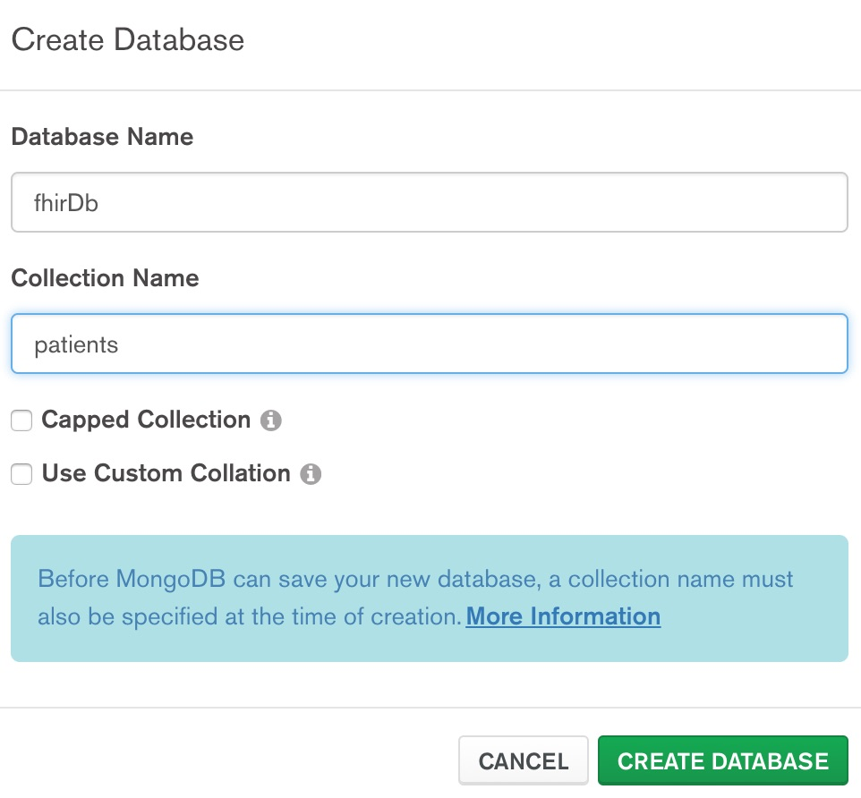
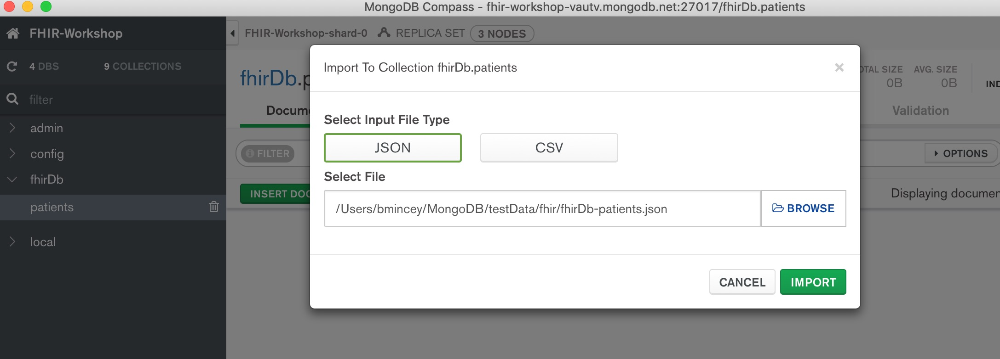
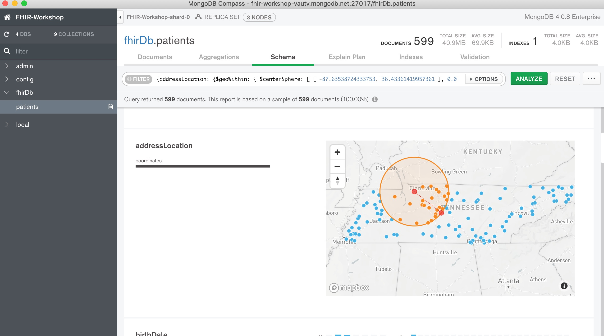
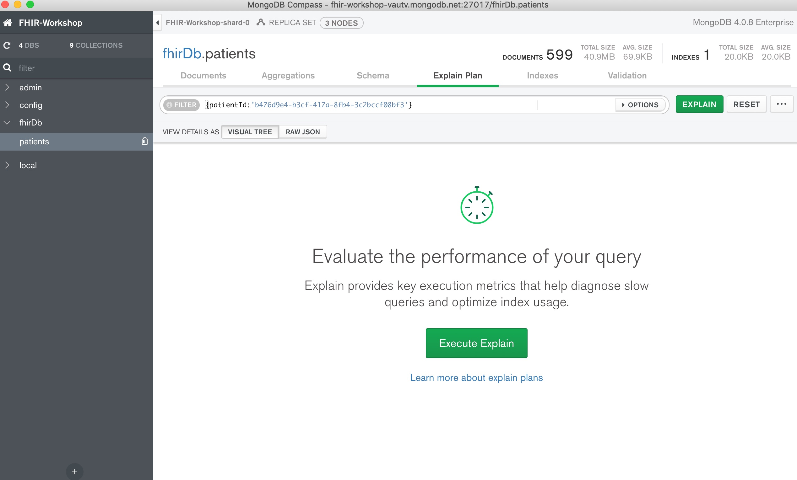
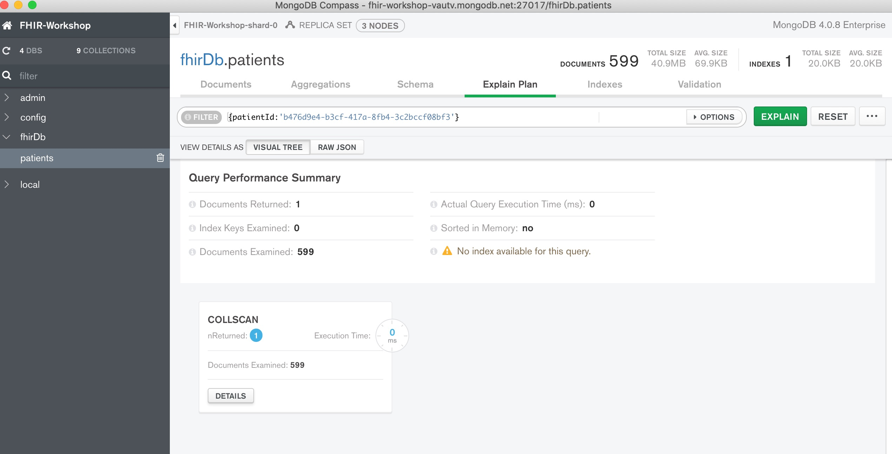

# mdb-101-healthcare-workshop
This repository contains a guide on getting started with MongoDB.
Specifically, this is a step-by-step tutorial/workshop incorporating MongoDB Compass, MongoDB Atlas, and MongoDB Stitch.
The data utilized in this workshop is based on the health care domain.  The data was acquired by generating sample data 
in [FHIR](https://www.hl7.org/fhir/formats.html) format from the [Synthea](https://github.com/synthetichealth/synthea)
project.

# Introduction to MongoDB
## Hands-on Workshop

### Overview
This hands-on workshop is designed to get you familiar with all general aspects of MongoDB.  This includes using either
a local running version of MongoDB or MongoDB Atlas (database as a service).  This workshop will walk you through
importing data into your MongoDB instance/MongoDB Atlas cluster.  Using MongoDB Compass, this workshop will provide
guidance on how to query data (CRUD), introduce the user to the aggregation framework, and optimize queries (explain plans/
indexes).  Next, the user can see how queries can be written in Node and Python.  Finally, the user will be introduced 
to MongoDB Atlas as well as the serverless platform, MongoDB Stitch.

### Required Prerequisites
To successfully complete this workshop, the following software should be installed:

* [MongoDB Compass](https://www.mongodb.com/download-center/compass) - This is a GUI to MongoDB that will be used to 
write queries.

* Access to a MongoDB instance.  You can either download [MongoDB](https://www.mongodb.com/download-center/enterprise)
and set it up on a workstation/server.  Or, the *recommended* way to complete the workshop, is by using [MongoDB
Atlas](https://www.mongodb.com/cloud/atlas), the fully managed service from MongoDB.  To access, simply create an account
at [https://cloud.mongodb.com](https://cloud.mongodb.com) or login to an existing account you may have previously
created. More details are below.

### Optional Prerequisites
During the course of the workshop, code samples will be used with both Node.js and Python.  If you choose to edit/run
the provided source files, you will need to be sure to have the following installed:

* Node.js - If you would like to edit/run the Node.js source files

* Python - If you would like to edit/run the Python source files

* For the MongoDB Stitch section, the workshop will interface with a REST endpoint.  This will be a GET method and
can be easily done with your browser.  However, if you want to use something like cURL or 
[Postman](https://www.getpostman.com/), please be sure to have the tools installed.

### Advanced/Optional Prerequisites
In Lab 2, the workshop will guide the user to load data using MongoDB Compass.  If you are an advanced MongoDB
user and would prefer to use the terminal/command-line, be sure to have the MongoDB command-line tools
installed.  The workshop does *not* go into detail on the installation/use of these tools.

* Binary Import and Export Tools  
[mongorestore](https://docs.mongodb.com/manual/reference/program/mongorestore)  
[mongodump](https://docs.mongodb.com/manual/reference/program/mongodump)  

* Data Import and Export Tools  
[mongoimport](https://docs.mongodb.com/manual/reference/program/mongoimport)  
[mongoexport](https://docs.mongodb.com/manual/reference/program/mongoexport)  

### Note:
If you use MongoDB Atlas, you must be able to make outgoing requests from your computer to MongoDB Atlas services
which will be running on port 27017.  Please confirm that port 27017 is not blocked by checking with 
[PortQuiz](http://portquiz.net:27017).  If successful, you will see a page load that indicates you can make outgoing
requests on port 27017.  The page looks similar to the one below:

### Hands-on Labs
#### Lab 1 - Create the Cluster (Skip to Lab 2 if you have MongoDB installed locally)
#### Create a Free Tier Cluster
#### Click Build a Cluster

Be sure to select the Free Tier Option for your cluster.
Take a moment to browse the options (Provider & Region, Cluster Tier, Version, Backup, ...).  For this workshop,
select AWS as the Cloud Provider:

Keep all of the defaults.  Be sure to name your Cluster Name to FHIR-Workshop (or anything you prefer) and then
click the green button to Create Cluster:

The cluster should complete provisioning within 5-7 minutes.

#### Install MongoDB Compass if you have not already
MongoDB Compass is the GUI for MongoDB.  Go to https://www.mongodb.com/download-center/compass to download and
install Compass for your platform.

#### After your MongoDB Atlas Cluster has been provisioned, setup Connection Security:
Return to the Atlas UI.  Your cluster should be provisioned.  Click the CONNECT button which will prompt you to setup
security:

After clicking the connect button, you should see the following:

Add your current IP address and Create a MongoDB User.  This example assumes a Username of 'fhir' and password 'workshop'.

Click Choose a connection method and select Connect with MongoDB Compass.

Then select 'I am using Compass 1.12 or later' and COPY the connection string presented:

#### Connect Compass
Start Compass and it should detect the connection string in your copy buffer:

Select Yes.

Provide the password ('workshop') and before clicking CONNECT, CREATE A FAVORITE named FHIR-Workshop.  This will
allow us to quickly connect to the cluster in the future.

Click CONNECT.

If successful, you will see some internal databases used by MongoDB:

#### Lab 2 - Load Data
We are now going to load data into MongoDB.  The data that will be used for this workshop
was parsed from file in FHIR format.  The data is in JSON format.

Download the dataset from Github. If you have the wget utility, you can get the dataset as follows:

wget https://raw.githubusercontent.com/mongodb/docs-assets/primer-dataset/primer-dataset.json

Otherwise, just open the link in your browser and once the load completes, save the file (File > Save Page As in Chrome).

Or, it is also included as part of this GitHub repo in the data directory as fhirDb-patients.json.

The dataset is 41 MB in size and contains around 600 patients (alive and deceased).

#### Create a Database and Collection  
Click the CREATE DATABASE button and create a 'fhirDb' database with a 'patients' collection:

  

Navigate to the patients collection and select Import Data from the menu.  
Then BROWSE to the fhirDb-patients.json file you downloaded:  

  

#### Lab 3 - Browse the Documents
Notice how the patients documents have a variety of structures beyond a relational/tabular database
which is limited to rows and columns.  Many of the patient documents contain arrays of 
sub-documents.  Working with data in this way is much easier than having to flatten out multiple
tables into a single object.

#### Lab 4 - Analyze the Schema
Analyze the schema?  Wait, I thought MongoDB was a NoSQL database and was considered to be schema-less?
While that’s technically true, no dataset would be of any use without a schema. 
Although MongoDB does not enforce a schema, your collections of documents will still always have one. 
The key difference with MongoDB is that the schema can be flexible/polymorphic.

Within MongoDB Compass, select the Schema tab and select Analyze Schema. 
Compass will sample the documents in the collection to derive a schema. 
In addition to providing field names and types, Compass will also provide a summary 
of the data values. 
For example, for language, we can see that in our population, we have 79% that speak
English as their primary language:  

  

For fun, take a look at the address field which contains a GeoJSON point, i.e., a longitude
and latitude coordinate.  You can drill down on the map as it builds the query for you.  

#### Lab 5 - Query Data with MongoDB Compass (CRUD Operations)  
Copy the code block and paste in the filter dialog in MongoDB Compass.

##### Find Operations  
* Simple filter (Single males)  
``
{maritalStatus:'S', gender: 'Male'}
``  

* Simple filter with query operators (Deceased with a date deceased of 2019)  
``
{isDeceased:true, dateDeceased : {$gte : ISODate('2019-01-01')}}  
``  

* Query sub-document/array  (Patients with 'Prediabetes' as a condition)  
``
{"conditions.conditionText":"Prediabetes"}
``  

* Query with AND as well as OR conditions (Deceased patients with either Sinusitis or has taken a medication starting with "Ace")  
``
{ isDeceased: true, $or: [ { "conditions.conditionText": "Sinusitis (disorder)" }, { "medicationRequests.display": /^Ace/ } ] }
``

* Query sub-document in array and project matched array element  
(Display Blood Pressure array element if the Systolic is greater than or = 140)  
Filter:  
``
{"observations.bloodPressure.display":"Systolic Blood Pressure", "observations.bloodPressure.value":{$gte:140}}
``  
Click Options and then in the Projection block:  
``
{patientId:1, "observations.$":1}
``

* Query using the $in (Display patients living in Memphis or Chattanooga)  
``
{city : {$in:["Memphis", "Chattanooga"]}}
``  

##### Update, Delete, Clone Operations  
Find a document and choose to update a field or fields.  In fact, add a field that
does not exist.  Next, clone a document.  Finally, delete the cloned document.
The MongoDB Compass interface provides all of the CRUD controls you need:  

  

#### Lab 6 - Create indexes to improve efficiency of queries  
Indexes support the efficient execution of queries in MongoDB. Without indexes, 
MongoDB must perform a *collection scan*, i.e. scan every document in a collection, 
to select those documents that match the query statement. 
If an appropriate index exists for a query, MongoDB can use the index to 
limit the number of documents it must inspect.  

In this lab, we will perform a search on a field, use the explain plan to determine if
it could be improved with an index, and create the index...all from within MongoDB Compass.  

Find a patientId to filter on.  For this example, we will use 'b476d9e4-b3cf-417a-8fb4-3c2bccf08bf3'.
Just make sure the patientId you use, exists within your dataset!

In the query box in Compass, enter the following:  
``
{patientId:'b476d9e4-b3cf-417a-8fb4-3c2bccf08bf3'}
``  

Then, click the Explain Plan tab as below:  

  

Click the Execute Explain button in the middle of the GUI and review the output.  

  

Considering this is a relatively small data size, an index may not immediately improve performance.
In our results, it indicates that a collection scan (bad!!) took place with our filter.  It also indicates
that the query took 0 milliseconds.  Again, if our data size was larger, this time would have been larger
as well.  We will now create an index on patientId and then run another explain plan.  

Click on the Indexes tab.  We will create an index on patientId.  Find the field in the
dropdown and select 'asc' as the index type.  Then, click the create button as below:  

  

After creating the index, go back to your Explain Plan tab and Execute Explain once more.
This time, you should see that your index was hit and instead of a collection scan (bad!!),
an index scan occurred.  Your results should be similar to that below:  

  

#### Lab 7 - Aggregation Framework  

##### 

# Work In Progress...

